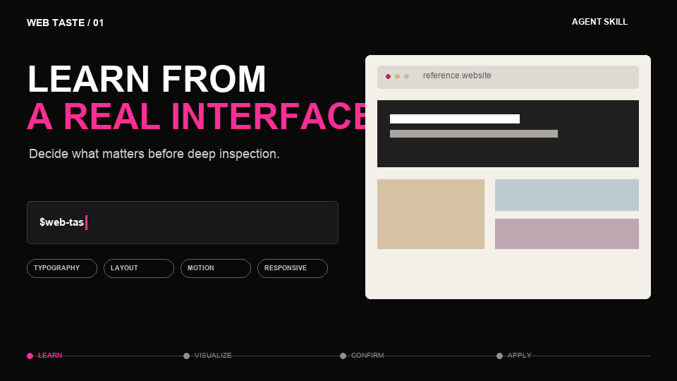
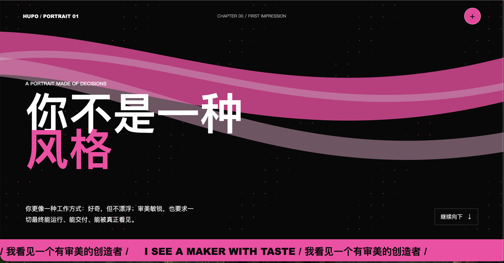
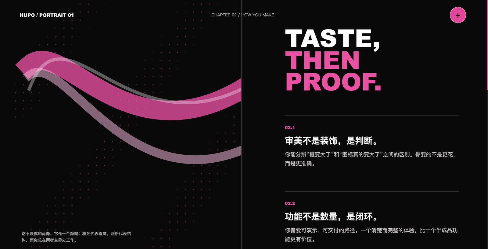
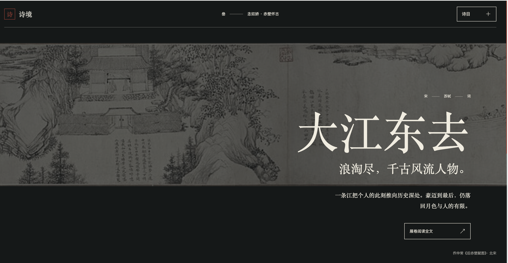

# Web Taste

**Teach your coding agent your taste, not a template.**

[](https://github.com/lllkn/web-taste/actions/workflows/ci.yml)
[](LICENSE)

Web Taste is a portable Agent Skill for Codex, Claude Code, Cursor, and GitHub Copilot that learns transferable design decisions from real websites, turns them into visual evidence, remembers only what you approve, and applies that memory to new interfaces.

It does not copy a reference site's identity, assets, code, or isolated CSS values. It learns the relationships behind the design: hierarchy, rhythm, proportion, color roles, component grammar, interaction states, responsive recomposition, and motion logic.

[中文说明](#中文说明) · [Quick start](#quick-start) · [See the results](#它能做出什么) · [Changelog](CHANGELOG.md)



*Learn from references, review visual evidence, approve what gets remembered, then apply that memory to new briefs.*

## Why Web Taste

Most frontend design prompts produce a one-off result. Web Taste builds a reviewable visual memory that improves through explicit decisions:

- **Evidence before opinion** — inspect rendered desktop, mobile, interaction, and motion states instead of guessing from source code.
- **Approval before memory** — show a Visual Taste Board and store only the principles the user accepts.
- **Context before reuse** — retrieve only the memories that fit the new audience, content, function, and emotional goal.
- **Choice when needed** — compare consequential directions when the user wants to choose; proceed when the user delegates the design.
- **Relationships over imitation** — transfer hierarchy and design logic without copying brand identity, proprietary assets, or source code.

## Quick start

Install from GitHub for the agents you use:

```bash
npx skills add lllkn/web-taste --skill web-taste -a codex -a claude-code -a cursor -a github-copilot -y
```

This installs at project scope. Keep only the agent targets you need; add `-g` for a personal installation. For local development, replace `lllkn/web-taste` with `.` from the repository root. If upgrading an older installation that stores personal data inside the skill, [migrate that library before replacing it](#个人数据与升级). Or ask your agent:

```text
Install the web-taste skill from https://github.com/lllkn/web-taste.
```

Then learn from a reference website (use `/web-taste` in Claude Code, a discovered skill in Cursor/Copilot, or `$web-taste` in the current Codex desktop host):

```text
Use the web-taste skill to learn the typography, layout, components, responsive behavior,
and motion from https://example.com. Show me a Learn Brief before deep inspection,
then present a Visual Taste Board and remember only what I approve.
```

Or apply your existing taste memory to a project:

```text
Use the web-taste skill to redesign this frontend. Start with an Application Brief and a
Memory Fusion Note, let me choose consequential component directions, then implement
and verify the result on desktop and mobile.
```

The workflow needs Python 3.9+, file access, and rendered browser evidence or screenshots. `agents/openai.yaml` is optional Codex UI metadata. Browser and preview capabilities vary by session; see [Agent compatibility](web-taste/references/agent-compatibility.md) for installation paths, invocation and supported fallbacks.

## How it works

```text
Reference websites
        ↓
Rendered evidence + Visual Taste Board
        ↓
User approval, correction, or rejection
        ↓
Traceable taste memory
        ↓
Application Brief + Memory Fusion Note
        ↓
Component choices → implementation → responsive verification
```

A submitted URL is not an endorsement. Web Taste records explicit approval at principle level, including global or project scope, rejection and revocation. Clear requests proceed without repeated scope confirmation; durable preference storage still requires explicit approval. An empty library does not block implementation.

## Latest changes

- One portable skill for Codex, Claude Code, Cursor and GitHub Copilot, with installation instructions and capability-based fallbacks.
- A private library outside the skill installation, plus backed-up migration from older libraries.
- Principle-level approval, rejection and revocation with global/project scope, traceable evidence and scoped retrieval.
- Stricter record/report validation and richer evidence boards; isolated component previews use matching viewports.

All 34 regression tests pass on Python 3.9 and 3.12. Installation and helper portability are verified; a complete workflow inside each agent remains to be verified. See the [changelog](CHANGELOG.md) and [verification record](docs/fix-verification.zh-CN.md) for details.

---

## 中文说明

让你的 AI 逐步形成自己的网页审美：从真实网页中学习前端视觉语言，把经过确认的设计规律沉淀为 taste memory，再复用到新的网页、组件和产品中。

Web Taste 不是一个“照抄参考站”的工具。它关注可迁移的关系，例如信息层级、排版节奏、空间比例、色彩职责、组件语法、交互状态、响应式重组和动效逻辑，同时明确排除品牌标识、专有素材、原站代码与其他不可复用内容。

## 它能做出什么

下面两个案例来自同一套 Web Taste 工作流。用户先提供若干参考链接，让 Codex 学习其中的前端视觉规律；确认后，这些规律进入本地 taste library。面对新任务时，Codex 再结合目标内容与已经确认的审美记忆进行筛选、融合和重新表达。

这些页面不是固定模板，也不是参考站复刻。它们展示的是同一套 taste memory 如何根据完全不同的主题，生成不同的视觉语言。

### 案例一：记忆中的我

目标不是制作普通个人主页，而是让 Codex 根据过去的合作、用户对设计方案的选择和已确认的 taste，生成一个“记忆中的我”。

最终页面把用户的工作方式组织成章节式视觉档案：黑色场景承载克制和判断，粉色作为明确的个性信号，流动曲线连接章节，超大中英文字建立强烈的叙事节奏。这里复用的是历史案例中已经确认的层级、动效和全屏叙事关系，而不是任何参考网站的品牌身份。





### 案例二：中国古诗展示页

第二个任务使用相同的知识库，但目标换成中国古典诗词。Codex 没有沿用个人档案的黑粉色表达，而是重新选择更适合诗词阅读的关系：画作成为完整场景，导航保持克制，宋体承担文化语气，内容通过数字长卷和分章阅读逐步展开。

这说明 taste memory 不是一组固定颜色或组件。它保存的是“什么时候应该突出什么、如何安排节奏、怎样让内容成为视觉主体”等可迁移判断，并根据题材、内容密度和情绪目标重新组合。




### 从参考链接到新页面

1. 用户提供参考链接和学习范围；范围清楚时直接推进，只澄清影响结果的缺失选择。
2. Codex 用真实浏览器收集证据，生成 Visual Taste Board，而不是只给文字感想。
3. 分开保存来源观察和用户偏好；只有逐条明确认可的原则进入正向偏好，保留全局或项目范围。
4. 新任务开始时，Codex 根据主题和功能检索相关记忆，提交 Application Brief 与 Memory Fusion Note。
5. 需要用户选择时展示可比方案；用户已委托设计时直接实现，并验证桌面端、移动端与交互状态。

## 功能

- **学习网页前端**：用真实浏览器观察参考网页的桌面端、移动端和关键交互状态。
- **建立视觉证据**：将截图、排版、色板、间距、组件状态和动效整理成 Visual Taste Board。
- **培养 AI taste**：只有经过用户确认的规律才会进入长期 taste profile；偶然特征、冲突偏好和明确拒绝的方向会分开记录。
- **复用设计规律**：根据新项目的用户、内容、功能和情绪目标，检索最相关的历史案例并形成 Memory Fusion Note。
- **按需选择方向**：关键选择需要用户判断时展示 2–3 个可比方案；已委托设计时直接推进。
- **可管理的个人记忆**：数据独立于 skill 安装目录，支持逐条认可、拒绝、范围限制、撤回和旧库备份迁移。
- **验证最终结果**：检查桌面端、移动端、交互状态、键盘可访问性、溢出和 reduced motion，而不只检查源代码。

## 工作方式

### 学习模式

1. 快速扫描参考网址。
2. 简述 Learn Brief，明确学习范围与是否持久保存；已有明确要求时不重复确认。
3. 深入检查布局、排版、颜色、图像、间距、组件、响应式和动效。
4. 输出可视化的 Visual Taste Board，区分观察、测量、解释和未知项。
5. 展示证据，按用户实际决定保存逐条认可、拒绝及适用范围；多个网站共同特征不能代替用户认可。

### 复用模式

1. 了解目标项目、用户、功能、内容和限制，简述 Application Brief，澄清重要未决选择。
2. 检索已认可的相关原则和排除条件，按需读取最多 4 个来源；空库或只有一个来源均可继续。
3. 需要用户选择时展示组件方案；否则形成一致设计方向并实施。
4. 实现并验证桌面端、移动端、交互与可访问性。

## 安装

### 使用 Agent Skills CLI（推荐）

从 GitHub 安装到需要使用的 agent：

```bash
npx skills add lllkn/web-taste --skill web-taste -a codex -a claude-code -a cursor -a github-copilot -y
```

只保留需要的 `-a` 参数；默认是项目安装，加 `-g` 为个人安装。在仓库根目录开发时可把 `lllkn/web-taste` 换成 `.` 安装本地版本。主工作流共用同一套文件，无需维护四份 skill。旧安装若仍在 skill 内保存个人数据，请先按[升级说明](#个人数据与升级)迁移，再替换安装。

| Agent | 原生项目目录 | 调用 |
| --- | --- | --- |
| Codex | `.agents/skills/web-taste/` | 选择 skill 或要求使用 `web-taste` |
| Claude Code | `.claude/skills/web-taste/` | `/web-taste` |
| Cursor | `.cursor/skills/web-taste/`，也支持 `.agents/skills/` | 从 skill 菜单选择或要求使用 `web-taste` |
| GitHub Copilot | `.github/skills/web-taste/`，也支持 `.agents/skills/` | 要求使用 `web-taste`，CLI 也支持斜杠调用 |

具体路径、个人安装和能力限制见[多 agent 适配说明](web-taste/references/agent-compatibility.md)。Skills CLI 可能使用 agent 支持的共用目录。

### 让 agent 安装

在对应 agent 中发送：

```text
请从 https://github.com/lllkn/web-taste 安装 web-taste skill。
```

### 手动安装

以下展示 Codex 官方文档列出的个人目录；其他 agent 将目标替换为上表或适配说明中的目录。

```bash
git clone --depth 1 https://github.com/lllkn/web-taste.git web-taste-repo
mkdir -p ~/.agents/skills
cp -R web-taste-repo/web-taste ~/.agents/skills/
```

在 agent 中检查 skill 是否已被发现；根据客户端要求开启新会话或重新加载。安装到正确目录和完整浏览器学习流程是两项不同的验证。

## 使用

以下自然语言示例适用于各 agent；Claude Code 可用 `/web-taste`，当前 Codex 桌面端也可用 `$web-taste`，其他客户端按实际 skill 发现结果调用。

学习一个网页并建立 taste memory：

```text
使用 web-taste skill 学习 https://example.com 的排版、组件、响应式和动效。先给我 Learn Brief，确认后再深入分析，并把我认可的规律保存下来。
```

将已经学习的 taste 用到项目中：

```text
使用 web-taste skill 重新设计这个前端。先结合我的 taste library 给出 Application Brief 和 Memory Fusion Note，关键组件让我选择方向后再实现。
```

学习并立即复用：

```text
使用 web-taste skill 学习这个参考站，然后把确认后的视觉规律应用到当前项目。不要复制品牌、素材或源码。
```

## 个人数据与升级

skill 的 `references/` 只包含静态说明和初始化模板。运行数据默认保存在：

```text
${XDG_DATA_HOME:-~/.local/share}/web-taste/
├── taste-profile.md       # 从明确的用户决定生成
├── site-index.md
├── decisions.jsonl        # 逐条认可、拒绝和撤回的历史
├── sites/
├── reports/
└── applications/
```

设置 `WEB_TASTE_LIBRARY_ROOT` 或使用 `--library-root` 可指定其他位置；后者放在子命令之前。将 `WEB_TASTE_SKILL` 设置为实际 skill 绝对目录，命令可从任何项目运行：

```bash
WEB_TASTE_SKILL="$HOME/.agents/skills/web-taste"
python3 "${WEB_TASTE_SKILL}/scripts/taste_library.py" root
python3 "${WEB_TASTE_SKILL}/scripts/taste_library.py" init
python3 "${WEB_TASTE_SKILL}/scripts/taste_library.py" search --query "editorial narrative" --scope project:poems
python3 "${WEB_TASTE_SKILL}/scripts/taste_library.py" validate
```

旧版把数据写在 skill 的 `references/`，请在覆盖旧安装前迁移：

```bash
python3 "${WEB_TASTE_SKILL}/scripts/taste_library.py" --library-root /absolute/private/library migrate --from /absolute/old/web-taste/references
```

迁移保留源目录、保存备份、修复库内绝对报告路径并拒绝覆盖已有记录。重复迁移不会重写现有记忆。旧偏好摘要保存为 `legacy-profile.md`；原文可以继续审阅，但不会绕过认可规则自动进入新偏好。迁移后的记录也保留旧证据；新增认可需要结构化、可审阅的 Board。

## 仓库结构

```text
.
├── README.md
├── CHANGELOG.md                      # 更新内容、升级影响与验证范围
├── docs/images/                      # 公开结果截图
└── web-taste/
    ├── SKILL.md                      # 模式选择、执行与记忆边界
    ├── agents/openai.yaml
    ├── scripts/
    │   ├── render_visual.py          # 证据板、实际字号、布局对照、隔离组件预览
    │   ├── taste_library.py          # 数据根、迁移、检索、逐条决定与校验
    │   └── test_workflow.py          # 行为回归测试
    └── references/
        ├── agent-compatibility.md    # 安装路径、能力降级与共享记忆
        ├── workflow-artifacts.md     # 报告数据格式与命令
        ├── visual-analysis-rubric.md
        ├── site-record-template.md
        ├── taste-profile.md          # 空库初始化模板
        └── site-index.md             # 空库初始化模板
```

运行脚本需要 Python 3.9+，仅依赖标准库。frontmatter 支持文档规定的扁平 YAML 子集，不支持任意嵌套 YAML。完整网页分析需要可操作的真实浏览器；只有截图时可记录可见观察，未测试的交互标为未知，无法读取计算样式时视觉估计标为解释而非测量。缺少 Python 执行能力时可先分析，持久保存交给具备兼容环境的会话。多个 agent 可以显式指向同一私人库，按顺序写入；云端不会自动获得本地记忆。

`reviewable` 报告必须有截图、观察或测量证据以及原则关联；缺证报告标为 `draft` 或 `incomplete` 并解释缺口，不能用于批准长期原则。HTML 组件预览隔离样式且禁用脚本；真实 JS 状态用组件截图展示。预览按钮不会自动保存用户批准。

## 本次更新与验证

此次更新加入 Codex、Claude Code、Cursor、GitHub Copilot 的安装适配，拆分 skill 与私人数据，补齐原则级认可/拒绝/撤回和项目范围检索，并修复记录校验、中文 ID、证据板和组件预览问题。详细内容见[更新记录](CHANGELOG.md)，修复与验证证据见[验证记录](docs/fix-verification.zh-CN.md)。

34 个行为回归测试已在 Python 3.9 和 3.12 下通过，覆盖迁移、审批、检索、校验及四种安装目录间的共享记忆。Skills CLI 的四目标隔离安装与桌面/手机报告渲染已验证；尚未在四种客户端中逐一完成完整的学习、人工审阅和复用流程。

在仓库根目录运行回归测试：

```bash
python3 web-taste/scripts/test_workflow.py
```

GitHub CI 会在推送到 `main` 和 Pull Request 时运行回归测试，并初始化、校验隔离个人库。

## 隐私与素材边界

公开仓库只发布 skill、模板、脚本和经授权展示的截图。运行数据写在独立个人目录，静态 profile/index 模板不再被用于保存私人内容。保留的旧 `sites/`、`reports/`、`applications/` 目录仍被 Git 忽略；项目本地 `.web-taste/` 和 `web-taste-library/` 也默认忽略。自定义数据目录的隐私由其位置决定。

不要未经授权公开第三方网页截图、专有素材或个人记录。尊重用户已有框架、设计系统和授权素材；学习可迁移关系，同时保留来源与适用限制。

## License

[MIT](LICENSE)
